 ## hola mundo 👋 i'm sahil

`npx sahilium` to meet me in your terminal!

```lisp
 ____________________________ 
< live long and prosper 🖖 >
 ---------------------------- 
  \
   \   \_\_    _/_/
    \      \__/
           (oo)\_______
           (__)\       )\/\
               ||----w |
               ||     ||
```


#### ~/.config/sahil.conf
```toml
title     = "developer"
name      = "sahil"
homepage  = "sahil.im"
mail      = "contact@?!?!?.im"

[skills]

[skills.langs]
great_at = [
    "ruby",
    "python",
    "js/ts",
    "java",
    "go",
    "c & c++"
]

learning = [
    "haskell",
    "rust"
]
```
#### summary


